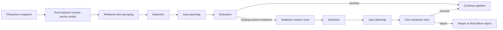

# Structure-first volume resolution

SunPack resolves archive volumes in two deliberately bounded phases. Initial discovery is
strict and cheap; a failed extraction may request exactly one structure-driven regrouping.
There is no general resolution loop and no filename-only camouflage grouping.

## Pipeline contract



The retry is guarded by `relation.volume_retry_attempted`. A replacement task reuses the
logical task identity, output directory and path lease, but is required to pass Detection and
Input Planning again. The resolver must add at least one path and produce a first volume.

## Evidence and naming policy

The native probe returns a `VolumeAnchor` for each candidate. Strong evidence includes a
validated 7z Start Header CRC, ZIP local header or exact-at-end EOCD, and RAR main-volume
header information. A leading gzip, bzip2, xz, zstd, Unix-compress or TAR structure marks the
file as a standalone stream and excludes it from another archive's volume search.

Initial Relations grouping accepts only strict conventional names. On the one retry:

1. Select a strong multi-volume anchor from the failed task.
2. Probe every sibling through the native batch API.
3. Accept structure-confirmed members of the same format and reject every structurally
   identified foreign format.
4. For formats whose middle parts are raw bytes, use the confirmed anchor's primary stem,
   archive-family token and nearby volume number to admit otherwise structureless members.
   A generic `partN`/numeric member is allowed only when that primary stem has exactly one
   structure-confirmed archive format in the directory; mixed-format stems require the format
   token and therefore cannot cross-merge.
5. Do not apply constrained filename matching when no strong anchor exists, for RAR members,
   or for an SFX anchor.

The relaxed decorated-name parsers are private to step 4. They are not exposed through
`parse_numbered_volume`, `detect_split_role`, initial grouping or watcher discovery.

Volume evidence is private to Relations. It is used to replace matching physical-file
candidates with one logical `ArchiveInputDescriptor`, then exposed only as diagnostic
`relation.volume_anchor` metadata. Detection never accepts, rejects, scores, filters or carves
a candidate from that anchor. It evaluates the logical input through its ordinary processors
and rules; repeated structural reads are absorbed by the native reader/session caches.

## Format matrix

| Format | Structure-bearing volumes | Conventional names | Retry fallback |
|---|---|---|---|
| 7z split | First part has the 7z Start Header; middle and tail parts can be raw bytes | `.7z.001`, `.7z.002`, ... | Anchor-constrained matching for raw members |
| ZIP raw split | First part has local-file structure; terminal part has an EOCD; middle parts can be raw bytes | `.zip.001`, `.zip.002`, ... | Anchor-constrained matching for raw members |
| RAR4/RAR5 volume set | Every native volume carries a RAR marker and main-volume header; RAR5 also carries an internal zero-based volume number after the first volume | `.part1.rar`, `.part2.rar`, ...; supported strict legacy RAR naming remains available | Structure only; no opaque member fallback |
| RAR SFX volume set | First volume may have an `MZ` stub before the RAR structure; later native volumes still carry RAR structure | `.part1.exe`, `.part2.rar`, ... | Structure only |
| ZIP spanned | Multi-disk metadata and `.z01` naming | Not supported by Relations | None |
| Generic byte-split RAR/SFX | No native per-volume structure | Not supported | None |

References: [7-Zip recovery and volume layout](https://www.7-zip.org/recover.html),
[RAR 5.0 archive format](https://www.rarlab.com/technote.htm),
[RAR volume naming](https://www.rarlab.com/rar_file.htm), and
[PKWARE ZIP APPNOTE](https://pkware.cachefly.net/webdocs/casestudies/APPNOTE.TXT).

## I/O and cache guarantees

All probing is implemented in Rust and opens data through the existing `ManagedReader`.
Ordinary files read at most a 512-byte head and 65,557-byte tail. Only a leading `MZ`
candidate receives an expanded prefix scan, capped at 1 MiB, for an embedded SFX signature.
No probe scales with archive or volume size, and directory-wide resolution does not create a
parallel extraction workload.

Use the shared benchmark harness to measure this contract:

```powershell
python -m benchmarks reader volume-anchor --files 128 --logical-mib 64 --rounds 5
```

The benchmark creates sparse temporary candidates, writes the versioned report beneath
`build/benchmark-results/reader.volume-anchor/`, and removes its temporary corpus on exit.

## Regression corpus

The real-archive integration test builds 7z, ZIP and RAR volumes with the bundled tools. Every
part is larger than 1 MiB. All formats are moved into one directory and renamed with one shared
primary stem, format-specific volume markers, arbitrary noise and fake suffixes. Resolution and
extraction run one format at a time, then the full pipeline verifies one and only one regrouping
attempt before Repair.
